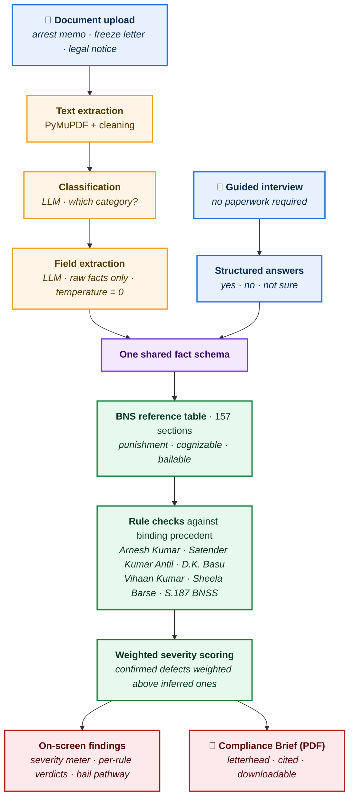

# Know Your Rights — Indian Legal Notice Analyzer

**A tool that reads an Indian legal or police document — or, where no document was ever given, asks a series of plain-language questions instead — and checks whether the authorities actually followed the law. Not just what the document says, but what it fails to say.**

Most legal-AI tools summarize. This one adjudicates. It takes a legal notice or police document, extracts the facts, and then checks those facts against binding Supreme Court procedural requirements — flagging where a citizen's rights may have been violated. It is built for the person on the receiving end of state or institutional power, not for the lawyer or the police.

**Live app:** [know-your-rights-legal-analyzer.streamlit.app](https://know-your-rights-legal-analyzer-q3nwj3r53kr8ygfaazgaf8.streamlit.app)

---

## The Problem

In India, procedural safeguards laid down by the Supreme Court are routinely ignored — not always maliciously, but because the people they protect don't know they exist.

A person is arrested for an offence punishable with under seven years. Under *Arnesh Kumar v. State of Bihar* (2014), the police were required to first serve a notice to appear, not arrest directly. They didn't. The family doesn't know this was mandatory. No lawyer has told them. The arrest proceeds, and a right that existed on paper is lost in practice.

The same pattern repeats across domains: a bank account frozen on a bare police letter with no legal section cited; a cheque-bounce notice issued outside the statutory window; a person held past the 60- or 90-day limit after which bail becomes a matter of right under Section 187 BNSS. In each case, the violation is knowable from the document itself — if you know what to look for.

This tool knows what to look for.

---

## Two Ways In

The people who most need this tool are often the ones police never gave any paperwork to. So the analyzer has two entry points, both feeding the same compliance engine:

- **Upload a document** — a PDF of an arrest memo, a freeze letter, a legal notice. The tool classifies it, extracts the facts, and rules on them.
- **Answer questions instead** — a guided interview for citizens with nothing in hand. Large tap-to-answer buttons, no legal terminology, a "Not sure" option on every factual question, and a back button at every step. Available for all three domains.

Both paths converge on the **same deterministic rule engine**, with zero duplicated legal logic. A finding reached through the interview is computed by exactly the same code as one reached from a document.

---

## What It Does

The analyzer classifies the case into one of several categories and runs domain-specific compliance checks against established case law and statute. Three domains are fully built and tested:

### 1. Banking & Cheque Bounce (Section 138, Negotiable Instruments Act)
Checks the four Supreme Court requirements for a valid Section 138 notice: the 30-day notice window from cheque return, that the demand equals the cheque's face value with interest stated separately (*Suman Sethi v. Ajay K. Churiwal*), that the cheque was issued for a legally enforceable debt (*Laxmi Dyechem*), and the 15-day payment window.

### 2. Police & Criminal Process — Arrest
Eight deterministic checks against binding precedent:

- **Threshold power to arrest at all** — whether the cited offence is cognizable. Police ordinarily have no general power to arrest without a warrant for a non-cognizable offence, a defect that sits above and before every question of notice timing.
- **Pre-arrest notice** for offences up to 7 years — *Arnesh Kumar (2014)*, reaffirmed in *Satender Kumar Antil, 2026 INSC 115*. This check resolves **which limb of Section 35(1) BNSS actually authorised the arrest** before ruling: an arrest made at the scene in police presence (S.35(1)(a)) owes no notice, while the same offence investigated and acted on days later (S.35(1)(b)) does. The tool tracks the affirmative bypass limbs — stolen property found in possession, proclaimed offender, obstruction or escape, arrest on requisition, preventive arrest under S.170 BNSS — and recognises a bypass **only where its factual predicate is actually established**, never from silence.
- **Written grounds of arrest** furnished to the arrestee — *Prabir Purkayastha (2024)* and *Vihaan Kumar, 2025 INSC 162*, under which failure violates Article 22(1), renders the arrest itself illegal, and is a ground for bail even where statutory restrictions apply.
- **Arrest memo safeguards** — witness attestation, family notification, medical examination — *D.K. Basu (1997)*
- **Night-arrest protection** for women — Section 46(4) CrPC / *Sheela Barse*
- **Female officer involvement** for a female arrestee — *Sheela Barse*
- **24-hour production** before a magistrate — Article 22(2) / Section 58 BNSS
- **Default bail** deadline calculation — Section 187 BNSS / Section 167(2) CrPC, computing the exact calendar date on which bail becomes a matter of right if no chargesheet is filed

A ninth check fires only where it is relevant: where **Section 223 BNS** is cited, the tool flags the Section 215(1)(a) BNSS bar under which no court may take cognizance except on the written complaint of the public servant whose order was disobeyed — a threshold defect capable of voiding the prosecution before any arrest question arises.

Alongside the verdicts, the tool reports the **bail pathway** — whether the cited offences are bailable, in which case bail is a matter of right that the officer in charge of the police station can grant directly under S.478 BNSS, or non-bailable, in which case only a court can. This is presented as information, not as a compliance verdict, and is deliberately kept out of the severity score.

### 3. Bank / Account Freezing (Sections 106 & 107 BNSS)
Checks whether a freeze cites any legal authority at all (in practice, many don't), whether it was restricted to the disputed amount or improperly blanket-froze the entire account, whether the jurisdictional magistrate was intimated, and whether the account holder was informed.

The tool derives the maximum punishment for an offence directly from the BNS sections cited — using a built-in reference table of 157 sections mapped from the old IPC, each carrying its punishment ceiling, cognizability and bailability — so it can apply the correct legal threshold even when the police document never states the punishment (which it usually doesn't). Where a real FIR cites several sections at once, all of them are read together, and the ceiling is taken across the whole set.

---

## Why This Isn't ChatGPT

The core architectural principle: **the language model extracts facts; deterministic Python code makes every legal ruling.**

A general-purpose LLM asked "is this notice compliant?" gives a different answer each time you ask, and will confidently invent case law. This tool never lets the model rule on compliance. The model's only job is to report what the document states — dates, sections cited, whether a witness signed, what time an arrest happened. Every compliance verdict is then computed by fixed Python logic against fixed legal rules. The same document produces the same verdict every time, and every verdict traces to a specific, checkable rule.

This separation is the whole point. It is what makes the output reproducible, auditable, and defensible — the things a legal tool cannot do without.

It also models honesty directly. Where a simple binary forces a compliant/non-compliant call, this tool distinguishes four states: **Compliant**, **Non-Compliant** (a confirmed defect), **May be Non-Compliant** (a defect inferred from a conspicuous silence — e.g., a memo that carefully documents every other safeguard but says nothing about the mandatory pre-arrest notice), and **Cannot Determine** (the rule applies but the document doesn't contain enough to check it). Police documents violate by omission far more than by admission, and the tool is built to catch that.

The same discipline governs what the tool refuses to guess. Where a cited section is an attempt or abetment provision whose punishment depends on the underlying offence, the tool says so rather than silently substituting a number — and where that uncertainty makes the default-bail window ambiguous, it computes **both** the 60-day and the 90-day date and names the condition that decides between them, rather than withholding a deadline that a family urgently needs.

---

## Architecture



**Read the colours.** Everything amber is the only place a language model is permitted to operate — reading a document and reporting what it says. Everything green is deterministic Python: the statutory lookup, the rule checks, the scoring. No legal judgment ever crosses from amber into green. The purple node is where both entry paths converge on an identical fact schema, which is why an interview answer and an extracted document field are indistinguishable to the engine that rules on them.

Built with Python, the Anthropic API (used strictly for fact extraction, never for legal judgment), Streamlit for the interface, and ReportLab for the generated brief.

---

## The Compliance Brief

Analysis that vanishes when the browser closes is of limited use to a family standing outside a police station. Every result can be downloaded as a formatted PDF brief — letterhead-styled, with the document summary, a colour-coded severity meter, each finding stated plainly beside its case-law citation, the default-bail date highlighted, the bail pathway, a document checklist, and the disclaimer.

Where the Arnesh Kumar notice requirement is flagged, the brief also reproduces the **consequences of non-compliance** laid down in *Arnesh Kumar v. State of Bihar*, (2014) 8 SCC 273 — departmental action and contempt of court before the territorial High Court for the officer, departmental action for a magistrate who authorises detention without recording reasons. That citation was verified against the primary judgment text before it was embedded.

It is designed to be handed to someone: a duty lawyer, a Legal Services Authority desk, a magistrate.

---

## Sample Output

Analysis of a sample arrest memo (offence under BNS 318(4), punishable up to 7 years, arrest made after the event):

```json
{
  "compliance_checks": [
    {
      "requirement": "S.35(3) BNSS notice before arrest [Arnesh Kumar (2014) / Satender Kumar Antil, 2026 INSC 115]",
      "status": "May be Non-Compliant",
      "explanation": "Offence punishable up to 7 years (looked up from cited section); arrest was made after the event on the basis of investigation, and no other arrest power under S.35(1) has been established — placing it on the S.35(1)(b) pathway. No mention of the mandatory S.35(3) notice. Per Satender Kumar Antil (2026 INSC 115): notice is the rule and arrest the exception."
    },
    {
      "requirement": "Threshold basis for arrest without warrant [cognizability of the offence]",
      "status": "Compliant",
      "explanation": "The cited offence(s) are cognizable — police ordinarily have power to arrest without a warrant. This does not by itself confirm the specific arrest power exercised was lawful."
    },
    {
      "requirement": "Produced before magistrate within 24 hours [Art. 22(2)/S.58 BNSS]",
      "status": "Non-Compliant",
      "explanation": "Produced 55.0 hours after arrest — exceeds constitutional 24-hour limit."
    },
    {
      "requirement": "Default bail on chargesheet delay [S.187 BNSS / S.167(2) CrPC]",
      "status": "Compliant",
      "explanation": "No chargesheet filed yet. Default bail becomes available on 05-09-2026 if not filed before then — 54 days remain."
    }
  ]
}
```

---

## Running It Locally

```bash
# Clone the repository
git clone https://github.com/Gh12890/know-your-rights-legal-analyzer.git
cd know-your-rights-legal-analyzer

# Create and activate a virtual environment
python -m venv venv
venv\Scripts\activate        # Windows
# source venv/bin/activate   # macOS / Linux

# Install dependencies
pip install -r requirements.txt

# Add your Anthropic API key:
# Create a file named .env in the project root containing:
#   ANTHROPIC_API_KEY=your_key_here

# Run the app
streamlit run app.py
```

Sample documents are included in the repository (`Sample_Arrest_Memo_*.pdf`, `Sample_Bank_Freeze_Notice_NoSection.pdf`, `Sample_Legal_Notice_Section138.pdf`) so the tool can be tested immediately. The guided interview needs no documents at all.

---

## Roadmap

Three domains are fully built and tested, through both the document and interview paths. The following are designed — with extraction schemas and case-law logic scoped — but not yet validated, and are honestly marked as work in progress rather than presented as finished:

- **Search & Seizure** — Section 50 NDPS safeguards (*Baldev Singh*), person-vs-premises scope (*Ranjan Kumar Chadha*), independent witness requirements
- **FIR Registration Dispute** — *Lalita Kumari* mandate and the CrPC/BNSS dual-regime inquiry-window logic (7 days vs 14 days, keyed on offence date)
- **Summons to Vulnerable Persons** — Section 179 BNSS residence-only rule for women and minors, *Sheela Barse* protections
- **Regional-language output** — the citizens least served by existing tools are the ones least served by English-only findings
- **Legal-aid routing** — connecting "consult a lawyer" to the nearest District Legal Services Authority, which already provides that help free under NALSA

The case-law and section-mapping data is current as of mid-2026 and is not yet version-controlled against future amendments — a known limitation for any tool in this space, and a planned area of work.

---

## Disclaimer

**This tool does not provide legal advice.** It reads a document and checks it against publicly known procedural requirements for educational and informational purposes. It cannot see facts outside the document it is given, and its findings — especially those marked "May be Non-Compliant," which are inferences from what a document omits — are not legal conclusions. Anyone facing a real legal situation should consult a qualified advocate. The section mappings and case-law references reflect careful research but should be independently verified before being relied upon.

---

## About

Built by a former Sub-Divisional Magistrate transitioning into legal technology, drawing on direct administrative and criminal-procedure experience to encode the procedural safeguards that most often go unenforced in practice. The project's design principle throughout: serve the citizen against institutional power, and never claim more certainty than the evidence supports.
